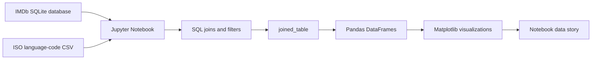

# Underrated Cinema Analytics

A relational data analysis project that uses IMDb movie metadata, SQLite, Python, Pandas, and Matplotlib to identify and visualize underrated films across genre, region, language, and decade.

## Overview

Underrated Cinema Analytics is a notebook-based data storytelling project built around a core research question: which movies appear to be high quality but under-recognized by IMDb users?

The project defines an "underrated" movie as a title with:

- `averageRating > 7.5`
- `numVotes < 10000`

Using those criteria, the notebook queries a relational IMDb database, joins normalized movie metadata into an analysis-ready table, computes descriptive statistics, and produces ranked tables and visualizations for several dimensions of cinema discovery. The intended audience includes data analysts, students, film researchers, and technically curious movie fans who want to explore lesser-known films with transparent, reproducible SQL and Python workflows.

The analysis workflow is:

1. Connect to a local SQLite IMDb database.
2. Join title, rating, alternate-title, region, language, and genre tables.
3. Materialize a reusable `joined_table`.
4. Establish an analytical threshold for "underrated" movies.
5. Query underrated films overall and by category.
6. Convert query results into Pandas DataFrames.
7. Visualize decade, region, and genre distributions with Matplotlib.
8. Document findings in a Jupyter Notebook data story.

## Features

- SQLite-backed analysis of IMDb movie metadata.
- Relational joins across movie title, rating, alternate title, language, region, and genre tables.
- Reusable denormalized analysis table named `joined_table`.
- Custom SQL median-vote calculation using SQLite window functions and common table expressions.
- Ranked underrated movie lists:
  - Top underrated movies overall.
  - Top underrated movie per genre.
  - Top underrated movie per region.
  - Top underrated movies by decade.
  - Top underrated movie by ISO language code.
- ISO language-code enrichment through `data/iso-language-codes.csv`.
- Pandas DataFrame presentation for tabular analysis.
- Matplotlib bar charts for:
  - Underrated movie counts by decade.
  - Top regions by underrated movie count.
  - Underrated movie counts by genre.
- Embedded narrative analysis, ethical considerations, methodology, and references inside the notebook.

## Architecture

This repository is a local analytics project, not a deployed web application. Its architecture is intentionally simple: a Jupyter Notebook orchestrates SQLite queries, Pandas transformations, and Matplotlib visualizations over local data files.



### Data Layer

The repository includes a SQLite database at `data/imdb_subset.db`. It contains the following tables:

| Table | Purpose | Key Fields |
| --- | --- | --- |
| `title_basics` | Base movie metadata | `titleId`, `titleType`, `primaryTitle`, `originalTitle`, `startYear`, `runtimeMinutes` |
| `title_akas` | Alternate title metadata, including region and language | `titleId`, `region`, `language`, `title` |
| `genres` | Genre assignments by title | `titleId`, `genre` |
| `ratings` | IMDb rating and vote metrics | `titleId`, `averageRating`, `numVotes` |
| `joined_table` | Denormalized table used by the notebook analysis | `titleId`, `primaryTitle`, `averageRating`, `numVotes`, `region`, `language`, `genre` |

The normalized tables reference `title_basics.titleId` through foreign keys from `title_akas`, `genres`, and `ratings`.

### Notebook Orchestration

`IMDB_Underrated_Analysis.ipynb` is the primary executable artifact. It performs database access, SQL execution, DataFrame construction, enrichment with language-code data, and visualization.

The notebook uses:

- `sqlite3` for database connectivity and SQL execution.
- `pandas` for tabular analysis and CSV merging.
- `matplotlib` for charting.
- `numpy` for chart positioning.
- `IPython.display` for styled in-notebook table presentation.

### Frontend

There is no web frontend in this repository. The user interface is the Jupyter Notebook itself, including rendered Markdown, DataFrames, styled tables, and inline plots.

### Backend and APIs

There is no backend server and no implemented API layer. All processing runs locally inside the notebook process.

### Database

The database is local SQLite. The committed database snapshot is `data/imdb_subset.db`, which is approximately 4.6 MB and contains:

| Table | Row Count |
| --- | ---: |
| `title_basics` | 4,537 |
| `title_akas` | 19,552 |
| `genres` | 6,331 |
| `ratings` | 13,816 |
| `joined_table` | 30,996 |

The included subset contains movie records in `title_basics`, with years from 1981 through 1999. The notebook narrative also references a fuller IMDb database and wider date range from the original course project.

### AI/ML Integrations

No AI, machine learning, model inference, embedding, or LLM integration is implemented in this repository.

### Cloud, Deployment, and Infrastructure

No cloud infrastructure, Dockerfile, Railway config, Vercel config, GitHub Actions workflow, or deployment pipeline is present. The project is designed to run locally in a Python/Jupyter environment.

### Authentication

No authentication or authorization system is implemented.

### Environment Variables

No environment variables are used by the repository.

## Tech Stack

### Languages

- Python
- SQL
- Markdown

### Frontend

- Jupyter Notebook rendered Markdown, DataFrames, and inline plots

### Backend

- Local Python notebook execution
- Python standard-library `sqlite3`

### Database

- SQLite

### AI/ML

- None implemented

### Cloud/DevOps

- None present

### Testing

- No automated test framework is present

### Tools

- Jupyter Notebook
- Pandas
- Matplotlib
- NumPy
- IPython display utilities

## Repository Structure

```text
.
├── IMDB_Underrated_Analysis.ipynb
├── README.md
├── LICENSE
└── data
    ├── imdb_subset.db
    └── iso-language-codes.csv
```

| Path | Responsibility |
| --- | --- |
| `IMDB_Underrated_Analysis.ipynb` | Main data story, SQL analysis, Pandas transformations, and Matplotlib visualizations. |
| `data/imdb_subset.db` | Local SQLite IMDb subset with normalized source tables and a precomputed `joined_table`. |
| `data/iso-language-codes.csv` | Mapping of ISO alpha-2 language codes to English language names. |
| `README.md` | Project documentation. |
| `LICENSE` | MIT License for the repository. |

## Setup Instructions

### Prerequisites

- Python 3.12 or compatible Python 3.x version.
- Jupyter Notebook or JupyterLab.
- SQLite support through Python's standard-library `sqlite3` module.

### Installation

Clone the repository:

```bash
git clone <repository-url>
cd RelationalDataViz
```

Create and activate a virtual environment:

```bash
python3 -m venv .venv
source .venv/bin/activate
```

Install the notebook dependencies:

```bash
pip install notebook pandas matplotlib numpy ipython
```

There is currently no `requirements.txt`, `pyproject.toml`, or `environment.yml`, so dependencies are installed directly.

### Database Setup

The repository includes:

```text
data/imdb_subset.db
```

The notebook currently opens:

```python
sqlite3.connect("data/imdb_full.db")
```

That full database file is not committed to the repository. To run the notebook exactly as written, place the full IMDb SQLite database at:

```text
data/imdb_full.db
```

For local exploration with the committed subset, the available database is:

```text
data/imdb_subset.db
```

It already contains the tables required by the analysis, including `joined_table`.

### Local Development

Start Jupyter:

```bash
jupyter notebook
```

Open:

```text
IMDB_Underrated_Analysis.ipynb
```

Run the notebook cells from top to bottom after confirming that the database path points to the SQLite database you intend to analyze.

### Build Commands

There is no application build step. If you want to export the notebook to HTML for sharing, use Jupyter's export flow or run:

```bash
jupyter nbconvert --to html IMDB_Underrated_Analysis.ipynb
```

### Production Setup

No production runtime is defined. This project is a local analytical notebook rather than a production service.

## API / Workflow Documentation

There are no HTTP APIs or service routes. The workflow is notebook-driven.

### Core Data Preparation Query

The notebook constructs a denormalized analysis table by joining the normalized IMDb tables:

```sql
SELECT
    tb.titleId,
    tb.titleType,
    tb.primaryTitle,
    tb.originalTitle,
    tb.isAdult,
    tb.startYear,
    tb.endYear,
    tb.runtimeMinutes,
    r.averageRating,
    r.numVotes,
    ta.region,
    ta.language,
    g.genre
FROM title_basics AS tb
JOIN genres AS g ON tb.titleId = g.titleId
JOIN ratings AS r ON tb.titleId = r.titleId
JOIN title_akas AS ta ON tb.titleId = ta.titleId;
```

The result is converted into a Pandas DataFrame and written back to SQLite as `joined_table`.

### Underrated Movie Definition

The analysis uses a fixed threshold:

```sql
WHERE numVotes < 10000
  AND averageRating > 7.5
```

The notebook explains this as an attempt to find movies that are rated highly by those who watched them but have not accumulated broad IMDb recognition.

### Ranking Workflows

The notebook includes SQL workflows for:

- Top underrated films overall using `WHERE`, `GROUP BY`, `ORDER BY`, and `LIMIT`.
- Top underrated film per genre using `ROW_NUMBER() OVER (PARTITION BY genre ...)`.
- Top underrated film per region using `ROW_NUMBER() OVER (PARTITION BY region ...)`.
- Top underrated films per decade using repeated decade-bounded SQL filters.
- Top underrated films per language, followed by a Pandas merge with ISO language-code data.

### Visualization Workflows

Matplotlib is used to generate bar charts that summarize:

- Number of underrated movies by decade.
- Number of underrated movies by region, limited to the top 50 regions.
- Number of underrated movies by genre.

## Testing

No automated tests are included. Validation is currently manual and notebook-based:

- Run notebook cells sequentially.
- Confirm SQLite queries execute successfully.
- Inspect DataFrame outputs.
- Inspect generated charts.

Recommended future validation would include a lightweight test script that verifies:

- Required database files exist.
- Required tables and columns are present.
- The `joined_table` can be rebuilt.
- Core SQL queries return non-empty results for a known database snapshot.

## Deployment

No deployment configuration is present. The repository does not include:

- Docker configuration.
- Railway configuration.
- Vercel configuration.
- GitHub Actions workflows.
- Cloud resource definitions.
- Backend service runtime.

The only supported execution mode discovered in the repository is local notebook execution.

## Challenges / Engineering Decisions

- **Relational modeling for analysis:** The source data is normalized across title, rating, alternate-title, and genre tables. The notebook creates `joined_table` to make repeated analytical queries simpler and faster to express.
- **Defining "underrated" quantitatively:** The project turns a subjective cultural concept into a reproducible metric using vote count and average rating thresholds.
- **Median calculation in SQLite:** SQLite does not provide a built-in median aggregate, so the notebook uses common table expressions and `ROW_NUMBER()` to compute median vote count.
- **IMDb metadata ambiguity:** Region and language fields can be incomplete, user-contributed, or multi-valued across alternate titles. The notebook acknowledges that these values should be interpreted carefully.
- **Notebook-first reproducibility:** Analysis, prose, tables, and visualizations are colocated in one notebook, making the project easy to read but dependent on the local data file path and notebook execution order.

## Future Improvements

- Add a `requirements.txt` or `pyproject.toml` to make dependency installation reproducible.
- Add a small setup script that detects `imdb_full.db` versus `imdb_subset.db`.
- Parameterize the underrated threshold for rating and vote count.
- Move reusable SQL into separate `.sql` files.
- Add a data validation notebook or test script for required tables, columns, and row counts.
- Export the finished notebook to HTML and commit it as a portfolio artifact if file-size constraints allow.
- Add chart image exports for README previews.
- Document the provenance and generation process for `data/imdb_subset.db`.

## Screenshots / Demo

The repository does not currently include standalone screenshot assets. The notebook contains rendered outputs and visualizations that can be viewed by opening `IMDB_Underrated_Analysis.ipynb` in Jupyter.

Suggested README preview assets for future updates:

- `docs/images/underrated-by-decade.png`
- `docs/images/underrated-by-region.png`
- `docs/images/underrated-by-genre.png`

## Author

Aniket Gauba

Project team credited in the notebook: Index-ception: Aniket Gauba, Fatima Abbas, Tri Dang, Amaya Joshi.

## License

This project is licensed under the MIT License. See [LICENSE](LICENSE) for details.
